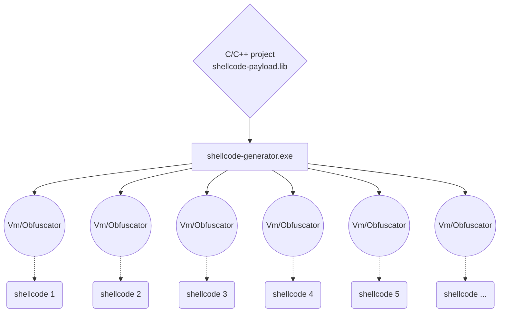

# shellcode-factory
> 一个简单shellcode生成框架，使用后可以变得开心。（开发中...）

# shellcode特点
> 位置无关，在执行或注入前无需进行任何额外的处理。

> 简洁小巧，可以轻松的在不同的功能中实现通用的功能。

# 更新

> - 加入了DWM屏幕截图 demo
> - 更新了一些bug 现在框架能作为生产工具安全使用 

# 使用方法

```shell
// 确保你已经安装了VS2019或以上 Make sure u have installed Visual Studio 2019 or later version
// 打开PowerShell并进入一个为项目准备的文件夹,依次输入以下命令, Enter the following commands in PowerShell

> git clone https://github.com/lainswork/shellcode-factory.git

> cd shellcode-factory

> devenv shellcode-factory.sln /build "Debug|x64" /Project shellcode-generator

> cd ./x64/Debug

> .\shellcode-generator

// 现在你得到了 ./x64/Debug/payload.hpp     Now, u get ./x64/Debug/payload.hpp

```


# 起因与经过
21年中旬朋友在windows的dwm进程中发现一段异常执行的 "恶意代码",
在使用ida进行简单分析后得出结论：“该代码在dwm中 hook 相关渲染函数，恶意截取用户桌面画面”。
这段代码的来源指向了一款曾在2017年爆火网络的多人射击游戏，我们猜测其目的为：“截取用户游戏画面以判断用户是否在作弊”。
该shellcode引起了我的兴趣，它大概有如下特点：
|  data types | ranges  |
| ------- | ------- |
| .api  | 0x0000 - 0x1D00 |
| .text | 0x1D00 - 0x2100 |
| .data | 0x2100 - 0x5000 |


在这个shellcode中，存在一些只会被链接进exe的清单文件，我猜测：“该shellcode的开发者先使用编译器编译并链接了一个不带crt的exe
之后对该exe进行加壳，最后使用exe to shellcode类的工具生成该代码。”

# 反思
类似的 shellcode 的生成过程似乎不是很可靠 (将无意义的清单文件留存在shellcode中与我们编写shellcode的目的相背离)，好奇心驱使下，我搜寻了 windows 下 的 shellcode 编写方法,结果不如人意。  
有的人使用dll to shellcode框架或工具
有的人直接在c++代码中写下两个“标记函数”，之后将两个“标记函数”地址之间的bytes复制出来。
下面是一些常见的框架：

[Cobalt Strike 生成 shellcode](https://bbs.pediy.com/thread-271048.htm)

[MSVC 配合 Get-PEHeader生成shellcode](https://zeronohacker.com/1544.html)

[Win PE系列之导出表解析与ShellCode的编写及应用](https://bbs.pediy.com/thread-269753.htm)

[基于C++的shellcode框架](https://bbs.pediy.com/thread-268639.htm)

我的目标是建立一个可以满足如下条件的shellcode生成框架：
```sh
1.不要让我用二进制编辑器来手动提取bytes
2.它应该有扩展的可能性
3.生成的shellcode应该与位置无关，在使用时只需要进行： 映射-执行
4.要能使用全局变量（静态变量），因为我们可能使用静态字符串
5.尽可能的支持新的c++标准
```
我们可以选择从编译链接入手，但是徒手撸编译器太难了，撸个小链接器却很容易
# 原理
### coff
coff全称 通用对象文件格式(Common Object File Format)，我们常用的PE（exe，dll，sys，lib，obj）文件都属于coff，但我们这里要说的，是lib。  
当我们在VS中将编译目标设置为lib时，.lib文件其实是个.obj文件的文件包，其中包含了你编译的所有.obj文件（也就是我们c++源代码.cpp所编译后的文件）。

### obj 
.obj是 coff的一种，obj文件中包含我们编写的源代码编译后的字节码，其中包含了极其详细的符号信息：每个函数的名称、函数的字节码、静态数据的字节码、重定位信息、等等。

### shellcode 链接方法
其实我们要做的事情很简单，将所有bytes从obj中提取出来，对相对寻址进行重定位就可以生成我们要的shellcode

# payload 代码
> 使用 SC_EXPORT 标志公开函数

```C++

SC_EXPORT 
DWORD ShellCodeEntryPoint(LPVOID lpParameter) {
    CHAR buf[256] = {0};
    LI_FN(sprintf)(buf, xorstr_( "函数%s 线程参数0x%p"), __FUNCDNAME__, lpParameter);
    LI_FN(MessageBoxA)(HWND(0), buf, xorstr_("来自shellcode的展示"), MB_OK);
    return 0;
}

SC_EXPORT 
DWORD ShellCodeEntryPoint2(LPVOID lpParameter) {
    CHAR buf[256] = {0};
    LI_FN(sprintf)(buf, xorstr_("函数%s 线程参数0x%p"), __FUNCDNAME__, lpParameter);
    LI_FN(MessageBoxA)(HWND(0), buf, xorstr_("来自shellcode的展示"), MB_OK);
    return 0;
}

SC_EXPORT
DWORD ShellCodeEntryPoint3(LPVOID lpParameter) {
    CHAR buf[256] = {0};
    LI_FN(sprintf)(buf,xorstr_( "函数%s 线程参数0x%p"), __FUNCDNAME__, lpParameter);
    LI_FN(MessageBoxA)(HWND(0), buf, xorstr_("来自shellcode的展示"), MB_OK);
    return 0;
}
```
> 使用 SC_EXPORT_DATA 公开全局变量 不要在 .h 中使用SC_EXPORT_DATA
```C++
SC_EXPORT_DATA(int, Xxxx)
```

> 使用内嵌函数 内嵌函数的具体规则请自己查询, 
```C++
//使用内嵌函数 这个东西只在本cpp起作用，不要写在.h里面 写在每个cpp的最开头部分
extern "C" {
#pragma function(memset)
void *__cdecl memset(void *dest, int value, size_t num) {
    __stosb(static_cast<unsigned char *>(dest), static_cast<unsigned char>(value), num);
    return dest;
}
#pragma function(memcpy)
void *__cdecl memcpy(void *dest, const void *src, size_t num) {
    __movsb(static_cast<unsigned char *>(dest), static_cast<const unsigned char *>(src), num);
    return dest;
}
}
```

##### 你可以在 payload 中做什么:

- 使用新标准的c++代码，包括但不限于初始化列表、Lamda表达式、模板函数

- 使用多个.cpp文件，这代表你可以将不同的代码写在不同的cpp中

- 使用字符串、全局变量、导出全局变量相对shellcode的偏移

- 使用面向对象与C++ STL模板

- 使用开源库[xorstr](https://github.com/JustasMasiulis/xorstr) ,加密常量字符串

##### 你无法在 payload 中使用什么:

- 不要使用全局初始化，因为shellcode不能进行 CRT init

- 无法直接调用 系统API（这将在本框架优化后解决），暂时的调用api方法是 使用lazy_importer

- 无法使用 __declspec(thread) Tls线程局部储存关键字（但可以使用windows apiTlsAlloc TlsSetValue TlsGetValue）来解决

- 异常 try catch (没啥用，请忽略)

- SDL检查(没啥用，请忽略)

- 基本运行时检查(没啥用，请忽略)

# 依赖
- [lazy_importer](https://github.com/JustasMasiulis/lazy_importer)
# 优势
- 开启C++优化 /O1
- 开发方便
# 缺陷:
### 该框架只支持 X64  
原因是目前没有好办法解决x86下的.data数据重定位问题，在x86下.data数据重定位类型为IMAGE_REL_I386_DIR32，意为"RVA 绝对虚拟地址"
但是假如你不在代码中使用静态字符串或者全局变量，你仍然可以使用x86编译 shellcode-payload.lib，并用 x86 shellcode-generator.exe生成相应的代码

对x86的支持，后面可能会通过硬编码插入来解决
# Todo:
修改api导入策略，摆脱lazy_importer，实现可以在payload中直接使用api函数和crt函数的方法。

实现链接时混淆和虚拟化，这样我们可以将shellcode-generator(链接生成器)作为服务器功能，将payload.lib储存于服务器，每次执行shellcode获取都会生成完全不同的代码。（这个比较困难）





